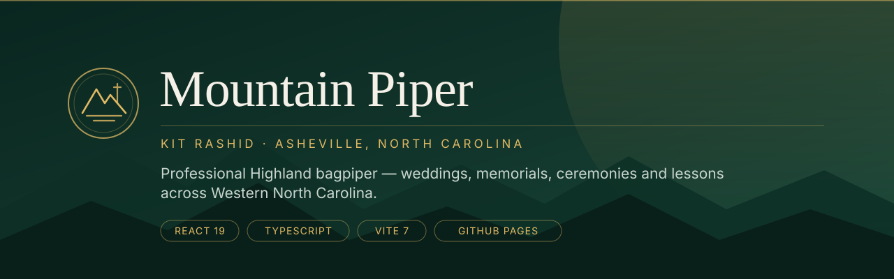

<div align="center">



<br />

[](https://zazieproductions.github.io/Mountain-Piper-website/)
[](https://github.com/zazieproductions/Mountain-Piper-website/actions/workflows/ci.yml)
[](LICENSE)

**The marketing website for Mountain Piper — Kit Rashid, a professional Highland bagpiper serving
Asheville and Western North Carolina.**

A React + TypeScript single-page application, engineered around local search intent
(*"Asheville bagpiper"*, *"wedding bagpiper Western North Carolina"*) and shipped to GitHub Pages
by continuous integration on every push to `main`.

[**Live site**](https://zazieproductions.github.io/Mountain-Piper-website/) ·
[**Documentation**](docs/README.md) ·
[**Contributing**](CONTRIBUTING.md) ·
[**Report an issue**](../../issues/new/choose)

</div>

---

## Contents

- [Why this project exists](#why-this-project-exists)
- [Highlights](#highlights)
- [Tech stack](#tech-stack)
- [Project structure](#project-structure)
- [Getting started](#getting-started)
- [Scripts](#scripts)
- [How deployment works](#how-deployment-works)
- [Architecture in 60 seconds](#architecture-in-60-seconds)
- [Performance](#performance)
- [Accessibility](#accessibility)
- [Search engine optimisation](#search-engine-optimisation)
- [Quality & continuous integration](#quality--continuous-integration)
- [Documentation index](#documentation-index)
- [Roadmap](#roadmap)
- [Contributing](#contributing)
- [Licence](#licence)

---

## Why this project exists

A bagpiper does not get discovered by being good at piping. They get discovered when someone in
Asheville types *"bagpiper for wedding"* into a search bar six months before the date.

This repository is the answer to that problem: a fast, accessible, static-hostable marketing site
built as a client-side React application but architected so that every route is a first-class,
individually optimised search result — unique title, unique meta description, canonical URL,
breadcrumb trail and JSON-LD structured data per page.

There is no backend, no CMS, no database and no hosting bill. The contact form composes a
`mailto:` message, the site is published by GitHub Actions, and the whole thing costs nothing to
run.

## Highlights

| | |
|---|---|
| **7 SEO-targeted routes + 404** | Home, Weddings, Funerals & Memorials, Events, Lessons, About, Contact — each with its own title, description, canonical, breadcrumbs and schema. |
| **Client-side SEO runtime** | `<SEO />` reconciles the document head per route: title, meta description, canonical, robots, Open Graph, Twitter cards, and JSON-LD blocks that are torn down and re-injected on navigation. |
| **Structured data by page** | `ProfessionalService`, `Person`, `Service`, `ContactPage`, `BreadcrumbList` and `FAQPage` schemas matching each page's real content. |
| **Zero-backend publishing** | `npm run build:pages` compiles, then copies the bundle to the repository root, where GitHub Pages serves it directly from `main`. |
| **Self-defending deploy** | The publish script refuses to write anything unless the built HTML actually references the `/Mountain-Piper-website/` base path — the exact failure that once put a blank page on the live site. |
| **Responsive image pipeline** | Every photo ships as WebP with a JPEG fallback across 400 / 800 / 1200 px, wired through `<picture>` + `srcset` + `sizes`. |
| **Accessibility by construction** | Skip link, focus-visible rings, focus restoration on route change, `aria`-annotated dialog menu with `Escape` handling and scroll lock, `prefers-reduced-motion` support, and a palette measured to WCAG AA or better. |
| **Green CI** | Lint, typecheck, standard build and Pages-base build all run on every pull request. |

## Tech stack

| Layer | Choice | Notes |
|---|---|---|
| **UI** | [React 19.2](https://react.dev) | Strict mode, function components only. |
| **Language** | [TypeScript 5.9](https://typescriptlang.org) | `strict`, `noFallthroughCasesInSwitch`, project references. |
| **Build** | [Vite 7.3](https://vite.dev) | `index.dev.html` is the single entry point. |
| **Routing** | [React Router 7.13](https://reactrouter.com) | `BrowserRouter` with a base path derived from `import.meta.env.BASE_URL`. |
| **Styling** | [Tailwind CSS v4](https://tailwindcss.com) (preflight only) + hand-authored design tokens | The reset is imported in `src/index.css` with source detection disabled; the entire visual system is hand-authored CSS driven by custom properties. |
| **Icons** | [lucide-react](https://lucide.github.io/lucide/) | Tree-shaken; decorative icons are `aria-hidden`. |
| **Motion** | [Framer Motion 12.35](https://motion.dev) | Installed and available; page transitions are not yet wired up. See the [roadmap](docs/ROADMAP.md). |
| **Quality** | ESLint 9 (flat config) + `typescript-eslint` + `eslint-plugin-react-hooks` + `eslint-plugin-react-refresh` | Zero errors. |
| **Hosting** | GitHub Pages | Project site, deployed from the root of `main`. |
| **Automation** | GitHub Actions | `ci.yml` (verification) and `publish-pages.yml` (deployment). |

> **Node version:** 22. Pinned in [`.nvmrc`](.nvmrc) and consumed by CI via `node-version-file`.

## Project structure

```
Mountain-Piper-website/
├── .github/
│   ├── ISSUE_TEMPLATE/           Bug, feature and content-change request forms
│   ├── workflows/
│   │   ├── ci.yml                Lint → typecheck → build → pages-base build
│   │   └── publish-pages.yml     Rebuilds and commits the static site on push to main
│   ├── CODEOWNERS
│   ├── PULL_REQUEST_TEMPLATE.md
│   └── dependabot.yml
├── docs/                         Technical documentation (see the docs index)
│   └── assets/banner.svg
├── scripts/
│   └── publish-github-pages.mjs  Copies dist/ to the repository root, with a base-path guard
├── src/
│   ├── components/
│   │   ├── Layout.tsx            Header, mobile nav dialog, footer, floating booking CTA
│   │   └── SEO.tsx               Per-route document head management + JSON-LD injection
│   ├── pages/
│   │   ├── HomePage.tsx          Hero, services, credentials, repertoire, FAQ, CTA
│   │   ├── WeddingPage.tsx
│   │   ├── FuneralPage.tsx
│   │   ├── EventsPage.tsx
│   │   ├── LessonsPage.tsx
│   │   ├── AboutPage.tsx
│   │   └── ContactPage.tsx       Validated inquiry form → mailto:
│   ├── App.tsx                   Router, scroll restoration, in-app 404
│   ├── index.css                 Design tokens + the full visual system
│   ├── main.tsx                  Bootstrap, GitHub Pages path normalisation
│   ├── publicAsset.ts            Base-path-aware asset URLs, srcset and router basename
│   └── siteConfig.ts             Canonical origin, default OG image, business name
├── public/                       Copied verbatim into the build (images, robots, sitemap)
├── index.dev.html                ★ Vite entry point — static head, schema.org base, noscript fallback
├── vite.config.ts
└── index.html · 404.html · assets/ · images/
                                  ⚠ Generated by `npm run build:pages`. Do not edit by hand.
```

## Getting started

```bash
# 1. Clone
git clone https://github.com/zazieproductions/Mountain-Piper-website.git
cd Mountain-Piper-website

# 2. Install (Node 22 recommended)
npm ci

# 3. Run the dev server
npm run dev
# → http://localhost:5173
```

The dev server rewrites `/` to `index.dev.html` on the fly, so the generated `index.html` at the
repository root never interferes with local development. Hot module replacement is enabled, and
the server binds `0.0.0.0` with all hosts allowed so it works behind tunnels and preview proxies.

## Scripts

| Command | What it does |
|---|---|
| `npm run dev` | Vite dev server on `http://localhost:5173` with HMR. |
| `npm run build` | `tsc -b` then `vite build` — full typecheck and production bundle. |
| `npm run build:pages` | Build in `pages` mode and publish the output to the repository root. **This is what CI runs.** |
| `npm run typecheck` | Typecheck only (`tsc -b`). |
| `npm run lint` | ESLint across the project. |
| `npm run lint:fix` | ESLint with automatic fixes. |
| `npm run preview` | Serve the last build locally. |

## How deployment works

GitHub Pages for this repository is configured as a **project site deployed from the root of
`main`** — GitHub does not run Vite. Rather than switch to an Actions-based Pages deployment (which
would put build artefacts on a `gh-pages` branch and break the repo-as-docroot mental model), the
compiled output is committed back to `main` by the workflow.

```
        developer pushes to main
                   │
                   ▼
   ┌───────────────────────────────┐
   │  publish-pages.yml            │
   │                               │
   │  npm ci                       │
   │  npm run build:pages          │
   │    ├─ tsc -b                  │
   │    ├─ vite build --mode pages │   base = /Mountain-Piper-website/
   │    └─ publish-github-pages.mjs│
   │         ├─ assert base path ✓ │   ← refuses to publish a blank bundle
   │         ├─ rewrite noscript   │
   │         └─ copy to repo root  │
   │                               │
   │  git commit + push            │
   └───────────────┬───────────────┘
                   │  (assets/, images/, index.html, 404.html,
                   │   .nojekyll, favicon.svg, robots.txt, sitemap.xml)
                   ▼
         GitHub Pages serves the site
```

Three details make this safe:

1. **The workflow ignores its own output.** `paths-ignore` excludes every published artefact, so
   the bot's commit does not retrigger the workflow.
2. **The publish script fails loudly.** If the built HTML does not reference
   `/Mountain-Piper-website/assets/`, the script throws before touching the working tree.
3. **`main.tsx` normalises the URL.** GitHub Pages serves `/index.html` without rewriting the
   address bar; the bootstrap strips the trailing `index.html` so React Router matches `/` instead
   of falling through to the 404 route.

Full details, including the local reproduction and rollback procedure, are in
[**docs/DEPLOYMENT.md**](docs/DEPLOYMENT.md).

## Architecture in 60 seconds

```
index.dev.html  ──►  src/main.tsx  ──►  <App/>  ──►  <BrowserRouter basename={routerBasename()}>
  (static head,          (strips              │
   base schema,           /index.html,        ├── <ScrollToTop/>  (scroll + focus on route change)
   noscript HTML)         seeds CSS var)      │
                                              └── <Layout>            ← header, nav dialog, footer, CTA
                                                    └── <Routes>      ← 7 routes + 404
                                                          └── <Page>
                                                                └── <SEO …/>   ← owns the document head
```

**`<SEO />` is the load-bearing idea.** Because this is a client-rendered SPA, nothing else in the
app can set the page title, canonical URL or structured data — so every page component renders a
declarative `<SEO />` that reconciles `<head>` on mount and on prop change, removes any previous
JSON-LD blocks (tagged `data-seo-jsonld`), and injects the new ones. `index.dev.html` carries a
matching static snapshot so crawlers and no-JS visitors get correct metadata before React hydrates.

**Base paths are resolved once.** `src/publicAsset.ts` exposes `publicAsset()`, `publicSrcSet()`
and `routerBasename()`, all derived from `import.meta.env.BASE_URL`. That single indirection is
why the same source tree serves correctly from `http://localhost:5173/` in development and from
`https://zazieproductions.github.io/Mountain-Piper-website/` in production.

Deeper walkthroughs: [**docs/ARCHITECTURE.md**](docs/ARCHITECTURE.md) ·
[**docs/SEO.md**](docs/SEO.md) · [**docs/DESIGN-SYSTEM.md**](docs/DESIGN-SYSTEM.md)

## Performance

Measured from a clean `npm run build` on Node 22:

| Asset | Raw | Gzip |
|---|---:|---:|
| `index.dev.html` | 5.92 kB | 1.88 kB |
| `index-*.css` | 35.35 kB | 8.34 kB |
| `index.dev-*.js` | 434.05 kB | 113.26 kB |

What is done deliberately:

- **LCP image is prioritised.** The hero `` sets `fetchPriority="high"` with explicit
  `width`/`height` attributes so it cannot cause layout shift.
- **WebP with JPEG fallback**, sized 400 / 800 / 1200 px, selected by `srcset` + `sizes`.
- **Fonts are preconnected** (`fonts.googleapis.com`, `fonts.gstatic.com`) and loaded with
  `display=swap`.
- **Scroll listeners are `passive`** and coalesced through `requestAnimationFrame`.
- **Six of seven images are `loading="lazy"`**; the seventh is the LCP hero, which is
  `fetchPriority="high"` instead.
- **No analytics, no tag managers, no ad or A/B scripts.** The only third-party origins the page
  contacts are `fonts.googleapis.com` and `fonts.gstatic.com`.

Known trade-off: the JavaScript is a single chunk. Route-level code splitting is on the
[roadmap](docs/ROADMAP.md).

## Accessibility

Accessibility is treated as a build requirement, not a nice-to-have:

- **Skip link** jumps to `#main-content`, which is `tabIndex={-1}` and programmatically focused on
  every route change.
- **Visible focus** — a 3 px gold ring via `:focus-visible`, suppressed for pointer interactions.
- **The mobile menu is a real dialog**: `role="dialog"`, `aria-modal`, `aria-expanded` /
  `aria-controls` on the toggle, focus moved to the first link on open, returned to the toggle on
  `Escape`, with `body` scroll locked while open.
- **Decorative icons are `aria-hidden`**; interactive elements carry accessible names.
- **Semantic landmarks** — one `<header>`, `<main>`, `<footer>`, and `aria-labelledby` tying every
  section to its heading.
- **`prefers-reduced-motion`** disables smooth scrolling and the rotating About-page seal.
  *(The venue marquee is not yet covered — see the [roadmap](docs/ROADMAP.md).)*
- **Contrast passes WCAG AA at every pairing in the palette**, measured against the tokens in
  `src/index.css`:

  | Foreground | Background | Ratio |
  |---|---|---:|
  | `--cream` `#f5f1e8` | `--forest-deep` `#09261f` | **14.24 : 1** (AAA) |
  | `--ink` `#172820` | `--cream` `#f5f1e8` | **13.69 : 1** (AAA) |
  | `--gold-bright` `#e1b964` | `--forest-deep` `#09261f` | **8.65 : 1** (AAA) |
  | `--gold` `#c99a45` | `--forest-deep` `#09261f` | **6.26 : 1** (AA) |
  | `--muted` `#607068` | `--cream` `#f5f1e8` | **4.64 : 1** (AA) |

## Search engine optimisation

Every route is a deliberately targeted keyword surface:

| Route | Primary intent |
|---|---|
| `/` | Asheville bagpiper |
| `/weddings` | Asheville wedding bagpiper |
| `/funerals-memorials` | Funeral & memorial bagpiper Asheville |
| `/events` | Bagpiper for events, ceremonies, commencements |
| `/lessons` | Bagpipe lessons Asheville |
| `/about` | Scottish / Highland bagpiper Western North Carolina |
| `/contact` | Booking and availability |

Per route: unique `<title>` and meta description, canonical URL against the production origin,
Open Graph and Twitter card tags, `BreadcrumbList` JSON-LD, and — where it genuinely applies —
`FAQPage` schema whose questions match the visible FAQ copy.

Supporting files: `robots.txt` (with tracking-parameter disallows), a 7-URL `sitemap.xml`, and
`ProfessionalService` base schema in the static head. Full strategy and the schema inventory live
in [**docs/SEO.md**](docs/SEO.md).

> **Note on the canonical origin.** `src/siteConfig.ts`, `sitemap.xml` and all structured data
> reference `https://mountainpiperavl.com`. Point a custom domain at the Pages site and keep that
> value in sync, or update all three together. See
> [docs/DEPLOYMENT.md](docs/DEPLOYMENT.md#custom-domain).

## Quality & continuous integration

[`.github/workflows/ci.yml`](.github/workflows/ci.yml) runs on every pull request and every push to
`main`:

```
npm ci  →  npm run lint  →  npm run typecheck  →  npm run build  →  vite build --mode pages
                                                                        │
                                                                        └─ asserts the
                                                                           /Mountain-Piper-website/
                                                                           base path is present
```

Both builds upload as workflow artefacts so a reviewer can download and inspect exactly what would
be published. Dependabot watches `npm` and `github-actions` on a monthly cadence.

Local equivalent:

```bash
npm run lint && npm run typecheck && npm run build
```

## Documentation index

| Document | Contents |
|---|---|
| [**docs/README.md**](docs/README.md) | Documentation home. |
| [**ARCHITECTURE.md**](docs/ARCHITECTURE.md) | Component tree, routing, the SEO runtime, base-path handling, data flow. |
| [**DEPLOYMENT.md**](docs/DEPLOYMENT.md) | GitHub Pages pipeline, publish script internals, custom domain, rollback. |
| [**SEO.md**](docs/SEO.md) | Keyword map, head management, structured data inventory, verification checklist. |
| [**DESIGN-SYSTEM.md**](docs/DESIGN-SYSTEM.md) | Colour tokens, typography scale, spacing, breakpoints, animation. |
| [**CONTENT.md**](docs/CONTENT.md) | Editing copy, prices, repertoire and photography — no build knowledge required. |
| [**TROUBLESHOOTING.md**](docs/TROUBLESHOOTING.md) | Blank site on Pages, wrong asset paths, broken deep links, stale builds. |
| [**ROADMAP.md**](docs/ROADMAP.md) | Known issues and planned work, prioritised. |

## Roadmap

Prioritised, and honest about what is not done yet:

- [ ] **Replace the `mailto:` contact form** — visitors without a configured mail client cannot
      send an enquiry. The highest-value change available.
- [ ] **Route-level code splitting** — `React.lazy` per page to cut the 113 kB gzipped bundle.
- [ ] **Prerender the 7 routes** — removes the only real SEO caveat of client rendering.
- [ ] **Framer Motion page transitions** — the library is installed but unused today.
- [ ] **`prefers-reduced-motion` for the venue marquee** — the one remaining ungated animation.
- [ ] **Automated tests** — Vitest + React Testing Library for form validation and the SEO runtime;
      Playwright smoke tests for each route.
- [ ] **Lighthouse CI budget** — fail the build on performance, accessibility or SEO regressions.
- [ ] **Open Graph image variants** — per-route share cards.

Tracked in [docs/ROADMAP.md](docs/ROADMAP.md) and in the [issue tracker](../../issues).

## Contributing

Contributions, corrections and content updates are welcome. Please read
[**CONTRIBUTING.md**](CONTRIBUTING.md) before opening a pull request — it covers branch naming,
commit conventions, the pre-flight checklist, and the one rule that matters most:

> **Never hand-edit `index.html`, `404.html`, `assets/` or `images/` at the repository root.**
> They are generated. Edit `index.dev.html` or `src/`, then run `npm run build:pages`.

## Licence

This is a proprietary, client-owned project. Source is viewable for reference and education, but
the content, photography, copy and design remain the property of Mountain Piper — Kit Rashid.
See [**LICENSE**](LICENSE) for terms.

---

<div align="center">

**Mountain Piper** — Kit Rashid · Asheville, North Carolina ·
[828.974.1719](tel:+18289741719) ·
[mountainpiper1@gmail.com](mailto:mountainpiper1@gmail.com)

*Built with React, TypeScript and Vite. Published by GitHub Actions.*

</div>
